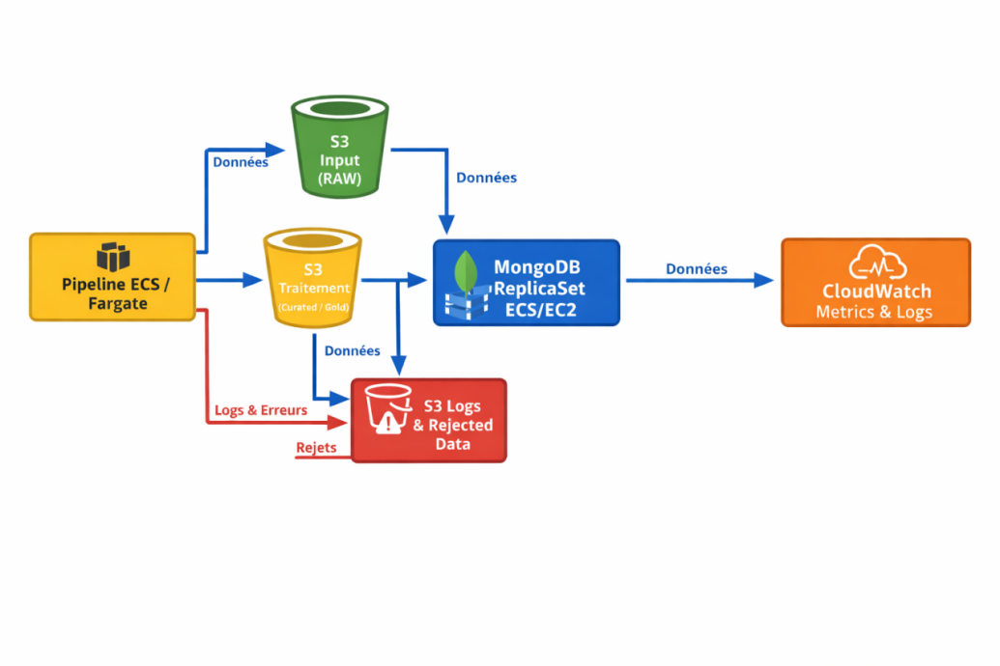

🌱 Green & Coop – Data Engineering Pipeline (Météo)
📌 Contexte

Ce projet a été réalisé dans le cadre d’un cas d’usage data engineering pour une coopérative agricole (Green & Coop).

L’objectif est d’exploiter des données météorologiques afin d’optimiser la prise de décision (production agricole, planification, gestion des ressources).

🎯 Objectifs
Collecter automatiquement des données météo depuis une API externe
Stocker les données brutes dans une couche raw
Déclencher automatiquement un pipeline de transformation
Nettoyer et préparer les données jusqu’à la couche curated
Stocker les données dans une base distribuée MongoDB
Assurer la haute disponibilité et la réplication
Mettre en place un monitoring complet (pipeline + base de données)
🏗️ Architecture Globale

Architecture distribuée cloud-native basée sur AWS :

Airbyte : ingestion automatisée des données météo
CRON (10–30 min) : planification des synchronisations
Amazon EventBridge : déclenchement du pipeline de transformation
AWS ECS Fargate : exécution du pipeline Python
MongoDB Replica Set (EC2) : stockage distribué
Amazon S3 : stockage des logs et données intermédiaires
Amazon CloudWatch : monitoring et métriques
🔄 Flux global

API météo
→ Airbyte (ingestion)
→ S3 / couche raw
→ EventBridge
→ Pipeline Python (ECS Fargate)
→ Données curated
→ MongoDB Replica Set
→ Logs & métriques (S3 + CloudWatch)

⚙️ Stack Technique
Python (pandas, requests)
MongoDB (Replica Set)
Docker / Docker Compose
AWS (ECS Fargate, EC2, S3, CloudWatch, EventBridge)
Airbyte
Git / GitHub
☁️ Infrastructure Cloud
🔹 Cluster MongoDB
3 instances EC2
3 conteneurs MongoDB
Déploiement via Docker
🔹 Replica Set MongoDB
1 PRIMARY
2 SECONDARY
Fonctionnement
Les écritures sont envoyées uniquement au PRIMARY
Les SECONDARY répliquent automatiquement les données
En cas de panne → élection automatique d’un nouveau PRIMARY

👉 Garantit :

haute disponibilité
tolérance aux pannes
continuité de service
🐳 Conteneurisation

Le projet repose sur deux images Docker personnalisées :

Image pipeline : exécution du pipeline Python
Image MongoDB : initialisation automatique du Replica Set

Orchestration via Docker Compose :

3 conteneurs MongoDB
1 conteneur pipeline
🔧 Initialisation automatique du Replica Set

Un script d’entrypoint personnalisé est exécuté au démarrage de chaque conteneur MongoDB.

Fonctionnalités
Détection automatique de l’IP du nœud
Attente de disponibilité locale MongoDB
Attente des autres nœuds (quorum)
Initialisation du Replica Set
Élection du PRIMARY
Création automatique de l’utilisateur admin
Redémarrage sécurisé avec authentification
Avantages
Gestion des race conditions
Initialisation automatique fiable
Déploiement reproductible
Sécurité renforcée (auth + keyFile)
🔄 Pipeline de Données
1. Ingestion
Données météo ingérées via Airbyte
Planification CRON (10 à 30 minutes)
Stockage en couche raw
2. Déclenchement
Pipeline déclenché par Amazon EventBridge
3. Enrichissement
Ajout et structuration des données
4. Transformation / Fusion
Consolidation et préparation des données
5. Nettoyage
Validation et filtrage
Préparation couche curated
6. Chargement MongoDB

Le pipeline :

détecte automatiquement le PRIMARY
se connecte au bon nœud MongoDB
insère les données préparées
remplace les collections existantes
sépare les données valides et rejetées
stocke les rejets dans S3
7. Test post-insertion
Vérification de cohérence des données
Validation de l’intégration MongoDB
8. Reporting
Génération d’un rapport pipeline
Suivi des transformations
9. Monitoring MongoDB
Mesure du Replica Lag
Envoi des métriques vers CloudWatch
10. Logs
Logs pipeline sauvegardés dans S3
Traçabilité complète
🗄️ Chargement MongoDB

Pour chaque dataset :

lecture depuis S3
validation des colonnes obligatoires
séparation valid / rejected
insertion dans MongoDB
overwrite des collections
export des rejets vers S3

👉 Le pipeline garantit que les écritures sont toujours envoyées vers le PRIMARY du Replica Set.

🚀 Orchestration
Airbyte : ingestion planifiée
EventBridge : déclenchement pipeline
ECS Fargate : exécution serverless

👉 Séparation claire :

ingestion
transformation
stockage
monitoring
📊 Monitoring & Observabilité
Métriques pipeline
total documents traités
documents insérés
documents rejetés
taux d’erreur
durée d’exécution
Métriques MongoDB
CPU / mémoire
état du Replica Set
Replica Lag
Logs
centralisés dans S3
métriques visibles dans CloudWatch
▶️ Déploiement
Lancer localement
docker-compose up --build
Initialiser MongoDB
rs.initiate()
rs.status()
📈 Résultats & Valeur

Ce projet démontre :

architecture data distribuée
ingestion automatisée avec Airbyte
orchestration cloud avec EventBridge
traitement serverless sur ECS Fargate
gestion d’un MongoDB Replica Set
initialisation automatique robuste
monitoring avancé (CloudWatch + S3)
pipeline data industrialisé
🚀 Perspectives d’amélioration
Migration vers MongoDB Atlas ou DocumentDB
Ajout d’un Data Warehouse (Redshift)
CI/CD pipeline
Dashboard BI (Power BI / QuickSight)

👩‍💻 Auteur

Projet réalisé par Marwa El Allouchi
Data Engineer (OpenClassrooms)